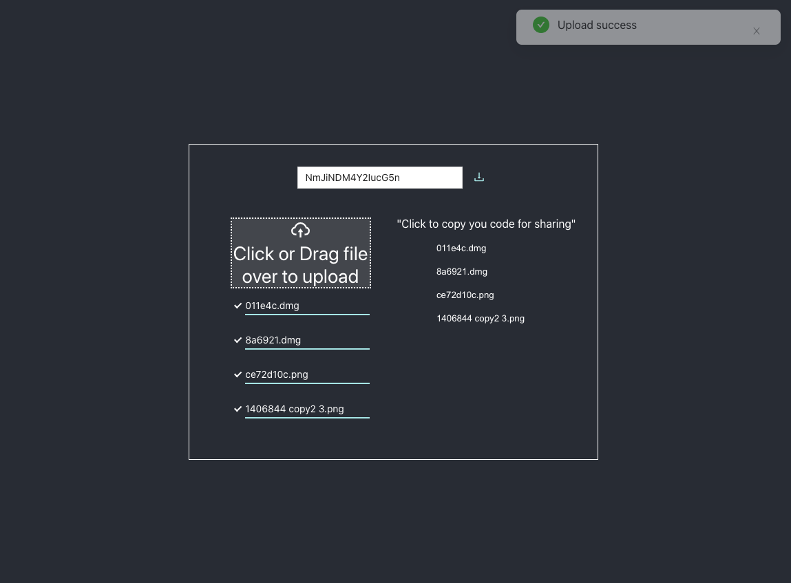

# How To Run it
  1. add a folder name `.cert`, make your ssl cert in this folder
  ```js
    - file-sharing
      - .cert
        - cert.pem
        - key.pem
  ```
  2. create your AWS account and create file name `.env.development` under `file-sharing`
  ```js
    - file-shraing
      - .env.development

    REACT_APP_S3_KEYID=your key id
    REACT_APP_S3_ACCESSKEY=your access key
    REACT_APP_S3_BUCKET=your bucket
    REACT_APP_S3_REGION=your region
  ```
  contact me if you need help: onlyfresh1689@gmail.com

# More Improvement

  - for front end
    - canceling uploading
    - maintaining state in url  
    - using more custom hooks eg: useHttp(), useDebounce(), etc
    - extacting duplicate code eg: create Context for sharing variables
  - connect to backend
    - storing the download code into backend, when user use download code for downloading, retrieve download code from db and return the real key in AWS s3
    - in the situation like request is too much
      - add cache eg: redis reducing response time when user accessing, CDN is also a good choice
      - scaling db, use consistent hash for store download code indexing 
  
# Snapshot


 